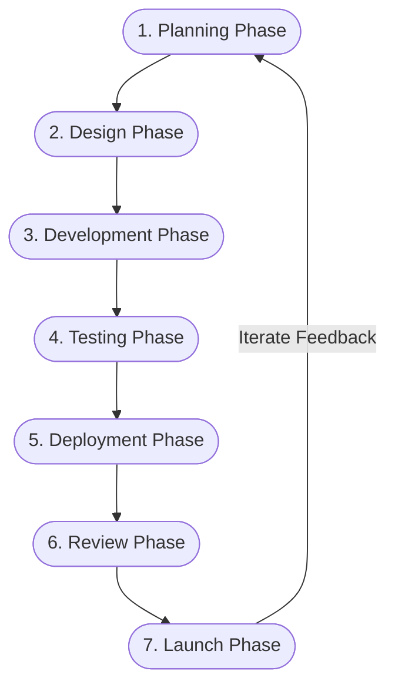
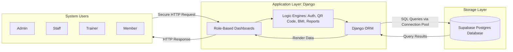
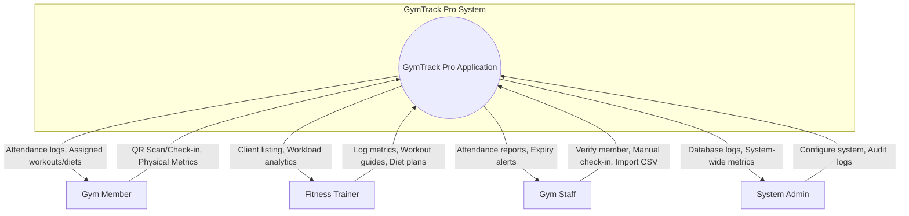
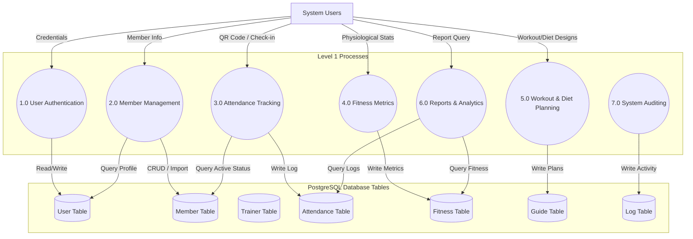
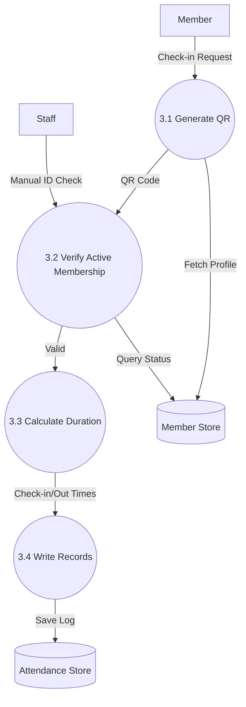
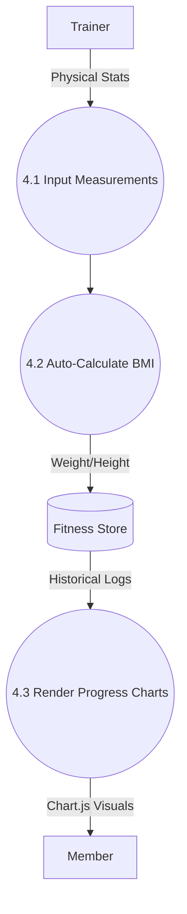
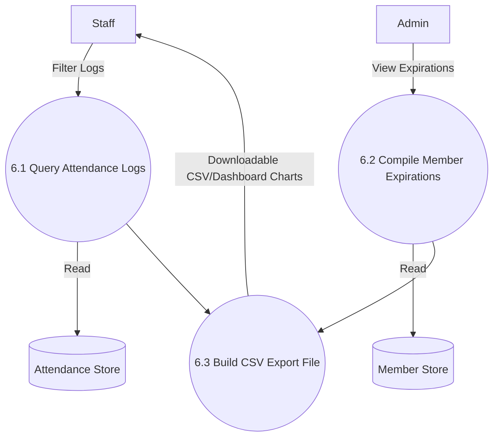
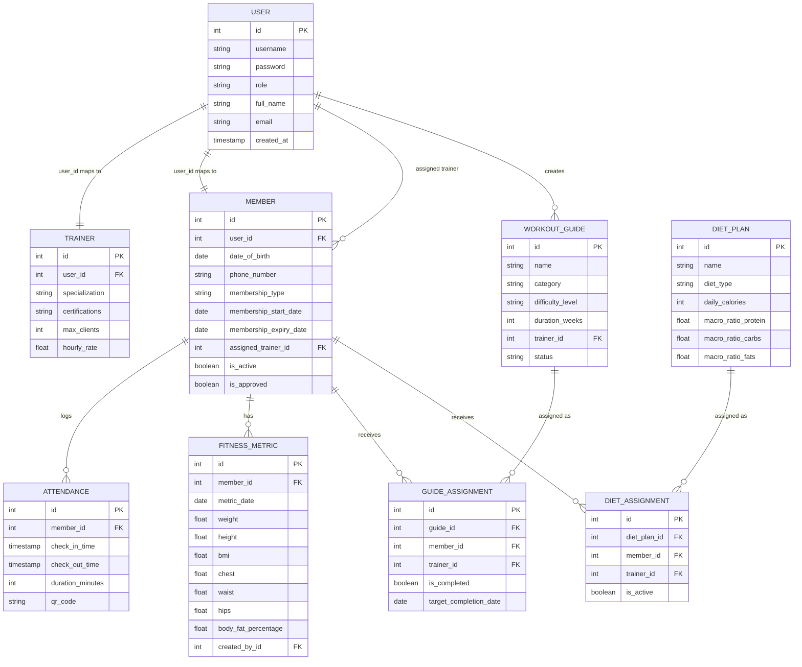

# GYMTRACK PRO: AN ADVANCED GYM MANAGEMENT AND MEMBER PERFORMANCE TRACKING SYSTEM

**A Capstone Project Manuscript**
Presented to the Faculty of the College of Computer Studies  
Carlos Hilado Memorial State University  
Mabini Street, Talisay City, Negros Occidental

In Partial Fulfillment  
of the Requirements for the Degree  
**BACHELOR OF SCIENCE IN INFORMATION SYSTEMS**

by  
**GYMTRACK PRO DEVELOPMENT TEAM**  
**MAY 2026**

---

## FORMATTING SPECIFICATIONS (MANUSCRIPT METADATA)
* **Paper Size**: A4 (210mm x 297mm)
* **Font**: Arial, 12pt (applied globally to headings, tables, and body)
* **Line Spacing**: Double-spaced (2.0) for narratives; single-spaced (1.0) or 1.15 for tables, code, and data dictionaries.
* **Margins**: Left Margin: 1.5 inches (108pt for binding); Right, Top, and Bottom Margins: 1.0 inch (72pt).
* **Alignments**: Main headings centered; sub-headings left-aligned; body justified; tables left-aligned.

---

# CHAPTER I: INTRODUCTION

The introduction of digitized data infrastructures in administrative frameworks is a critical necessity for operational optimization, eliminating workflow redundancies, and elevating consumer engagement (John, 2022). Historically, the wellness and fitness industry in the Philippines has operated on localized, paper-based tracking sheets or fragmented spreadsheets to manage member information, attendance logs, and workout assignments (Purcia & Velarde, 2022). While these manual protocols sufficed during early-stage business operations, the scaling of modern fitness centers demands centralized, real-time databases to prevent data corruption, secure personal physical information, and streamline administrative procedures.

According to a comprehensive 2023 UNESCO study, manual data management infrastructures across both public and private sectors continue to suffer from localized information gaps, poor physical security, and high administrative friction (Zewde et al., 2020). These inefficiencies translate into commercial losses, reduced consumer trust, and high workload overheads for operational staff. The integration of modern web applications, powered by structured databases, mitigates these vulnerabilities by offering a single point of truth for member verification, automated progress analysis, and secure access management. 

To address these systemic administrative challenges within the localized fitness domain, the researchers developed **GymTrack Pro**, a comprehensive, secure, role-based gym management system. The system integrates automated attendance tracking using timed QR codes, automated fitness metric tracking with instant World Health Organization (WHO) BMI classifications, trainer-to-client workloads, and granular role-based access controls. The deployment of this centralized platform at local wellness facilities aims to replace obsolete physical ledger sheets with a secure, highly efficient, and data-driven administrative environment.

## 1.1 Background of the Study
The core problems confronting manual operations in typical fitness clubs are operational slow-downs, data inaccuracies, and the inability to track members' physical progress over time. For instance, gym staff members must manually log member check-ins, verify membership active status, and calculate attendance durations. This process leads to peak-hour queues, membership verification errors, and unauthorized gym usage. Additionally, personal trainers must manually write workout plans, record body measurements, and calculate body-mass index (BMI) using separate charts, which increases human errors and delays client feedback.

From a management perspective, gym owners lack real-time analytics dashboards to monitor member retention, active trainer capacities, peak attendance hours, and expiring memberships. This structural information gap prevents managers from making informed, data-driven decisions regarding staff scheduling, equipment purchases, or promotional offerings. Furthermore, the handling of sensitive physical health records (e.g., body fat percentages, muscle mass, hip/waist measurements) on paper cards violates standard data privacy principles, exposing members to security risks.

To overcome these structural operational deficiencies, this study presents a centralized, secure web-based gym management solution called GymTrack Pro. Developed using the Django web framework and backed by a Supabase PostgreSQL relational database, the system automates member check-ins, tracks fitness progressions with visual line charts, handles trainer assignments, and compiles administrative reports. The implementation of this platform provides gym owners, trainers, staff, and members with role-specific dashboards, reducing administrative overhead and ensuring secure, structured records management.

## 1.2 Objectives of the Study
The primary purpose of this study is to design, develop, test, and evaluate **GymTrack Pro**, an advanced gym management and member performance tracking system, to digitize administrative processes and provide data-driven wellness tracking.

Specifically, this study aimed to:
1. Design and develop a secure, responsive web application with the following key components:
   1.1. Role-Based Access Control (RBAC) with four specialized dashboards (Admin, Staff, Trainer, and Member);
   1.2. Automated Member Management (CRUD, batch CSV imports, trainer-to-client assignment histories);
   1.3. Attendance Tracking (24-hour expiring QR code generation, dual manual/QR check-in/out logging, automatic duration calculations, and inactive member alerts);
   1.4. Member Fitness Progress Tracking (auto-calculated BMI with WHO classifications, body measurements, 90-day progress charts, and exportable progress summaries);
   1.5. Trainer Management (trainer specializations, certification logs, and active client capacity limits); and
   1.6. System Analytics & Automated Reports (expiring membership warnings, attendance trend logs, and exportable CSV sheets).
2. Test the functional integrity, database transactions, and E2E pathways of all 41 core system routes.
3. Evaluate the software quality of the developed platform based on the ISO/IEC 25010:2011 standard across the following quality characteristics:
   3.1. Functional Suitability;
   3.2. Performance Efficiency;
   3.3. Compatibility;
   3.4. Usability;
   3.5. Reliability;
   3.6. Security;
   3.7. Maintainability; and
   3.8. Portability.
4. Draft a comprehensive User's Guide to support seamless system adoption and onboarding.

## 1.3 Significance of the Study
This study contributes directly to the modernization of local fitness center operations. By automating manual administrative workflows and providing secure data tracking, the project benefits several key groups:

* **Gym Management and Owners**: The system provides real-time operational analytics, peak-hour logs, and membership status dashboards, allowing managers to allocate resources, monitor staff workloads, reduce unauthorized usage, and increase membership renewals.
* **Gym Staff**: The automation of check-ins, membership verification, and bulk CSV uploads eliminates tedious physical record-keeping, reducing peak-hour administrative queues and human errors.
* **Fitness Trainers**: Personal trainers gain immediate access to their assigned clients' profiles, enabling them to digitalize workout guides, assign dietary plans, record progress metrics, and monitor clients' physical improvements with real-time progress charts.
* **Gym Members**: Members receive personal dashboards to monitor their attendance history, view assigned workout and diet guides, log physical activities, and track their fitness metrics (weight, body measurements, BMI trends) on interactive charts.
* **Researchers**: The development and evaluation of this system serve as a reference for applying modern web architectures (Django, Supabase, Postgres) in specialized fitness and health domain management.
* **Future Researchers**: This study provides a structured framework and empirical data on applying the ISO/IEC 25010 standard to assess software usability and efficiency in wellness domains.

## 1.4 Scope and Limitations
The scope of GymTrack Pro covers the administrative, operational, and physical progress tracking components of a modern gym. The system supports four distinct user roles, each with a secure, custom portal:
* **Admin**: Complete administrative capabilities, including user registration, system audit logging, trainer and member lists, custom workout tip categories, database backup logs, and global analytics.
* **Staff**: Handles daily operations, including manual member check-in/out, batch member imports from CSV templates, membership verification, and attendance reports.
* **Trainer**: Manages assigned clients, designs and publishes workout guides, tracks macro-nutritional diet plans, and records fitness metrics.
* **Member**: Personal access to track attendance logs, view trainer details, check assigned workout/diet guides, and input daily activity logs.

The system is deployed as a cloud web-application, using Django's ORM mapped to a Supabase Postgres cloud database. 

### Limitations:
* The system does **not** include financial billing systems, direct POS merchant integrations, or automated credit card billing.
* The system does **not** require external hardware access systems (such as RFID turnstiles or biometric fingerprint scanners). Membership check-ins are limited to web-based QR-code scanning or manual staff check-ins.
* The system requires continuous internet connectivity to synchronize data with the Supabase cloud database; offline caching is not supported.

## 1.5 Definition of Terms
The following terms are defined in accordance with their technical and operational applications within this study:

* **Agile Model**: An iterative software development framework that prioritizes collaborative feedback, adaptive planning, and rapid incremental software releases across 7 distinct sprint cycles (Planning, Design, Development, Testing, Deployment, Review, and Launch).
* **Attendance Tracking**: The operational process of capturing member entry and exit timestamps, calculating physical workout duration in minutes, and compiling daily/weekly peak occupancy statistics.
* **Body Mass Index (BMI)**: A numerical measurement of body fat based on height and weight ($BMI = \frac{weight\_kg}{height\_m^2}$). operant in the system via automatic WHO categories: Underweight, Normal, Overweight, Obese.
* **Bcrypt**: A secure, computationally expensive password hashing algorithm configured with 600,000 iterations to encrypt all user credentials stored in the PostgreSQL database.
* **Django**: A high-level, open-source Python web framework utilizing a Model-View-Template (MVT) architecture, which manages the application logic, secure authentication, and database migrations.
* **Entity Relationship Diagram (ERD)**: A graphical representation of the relational database structure, mapping tables (User, Member, Trainer, Attendance, FitnessMetric, WorkoutGuide, DietPlan), primary/foreign keys, and database constraints.
* **Fitness Metric**: The collection of physiological tracking parameters including body weight, total height, body fat percentage, muscle mass, and measurements (waist, hips, chest, bicep, thigh).
* **Supabase**: A modern open-source backend-as-a-service (BaaS) platform hosting the PostgreSQL relational database and handling remote secure connection strings.
* **Two-Factor Authentication (2FA)**: A secure authentication protocol where users must supply two distinct forms of identification: their standard login credentials and a secondary, time-sensitive One-Time Password (OTP) sent to their registered email.

---

# CHAPTER II: REVIEW OF RELATED LITERATURE AND SYSTEMS

This chapter reviews local and international research papers, articles, and commercial software systems relevant to the design, execution, and software evaluation of GymTrack Pro.

## 2.1 Foreign Literature
### Gym Technology Integration and Member Retention
Digital management portals are essential tools for retaining members in commercial health clubs. Implementing user-centric digital tracking portals enhances member retention rates by 22% compared to traditional clubs. Providing self-service booking modules, digital fitness dashboards, and automated check-ins reduces consumer friction, which increases operational efficiency and trust (Ramya & Ranjith, 2022).

### Cloud-Based Relational Infrastructure in Sports Science
Sports and wellness centers require high-availability cloud storage architectures to manage members' historical physical records. Utilizing structured cloud relational databases (e.g., PostgreSQL) ensures data integrity, ACID transactional compliance, and rapid retrieval of client histories. These features are critical when personal trainers design customized physical conditioning programs (Gomathy, 2022).

### User Acceptance and Security in Sports Systems
Implementing role-based user portals in health clubs requires strict security protocols. Research reveals that user adoption rates of health software depend directly on perceived security, data privacy, and ease of use. Integrating standard security measures, such as Bcrypt encryption, session timeout limits, and robust data isolation, increases user trust and system acceptance (Schöpfel et al., 2020).

### Data-Driven Performance Analysis in Wellness Systems
Incorporating automated analytics in fitness trackers helps identify member behavior trends. Data analysis of member attendance logs and fitness metrics enables gym managers to predict membership expirations and identify inactive members (Zhang et al., 2024). This automated capability supports proactive member engagement strategies, enhancing long-term operational sustainability.

## 2.2 Local Literature
### Modernization of Philippine Fitness Centers
Philippine commercial gyms face challenges due to manual logbooks and fragmented spreadsheet tracking. Obsolete manual recording methods lead to check-in bottlenecks, data redundancy, and membership verification errors. Implementing custom-designed localized information systems is a viable solution to improve efficiency, customer satisfaction, and security in the Philippine wellness sector (Ali, 2022).

### Data Privacy Compliance in Philippine Health Portals
Philippine fitness clubs collecting physiological data must comply with the Data Privacy Act of 2012 (Republic Act No. 10173). Health clubs must protect sensitive member information—including contact details, emergency contacts, and physical measurements—from unauthorized access. This research highlights the need for robust security controls in localized administrative applications (Balicoco & Enad, 2023).

## 2.3 Foreign Systems
### Mindbody
Mindbody is a leading international commercial SaaS platform designed for wellness, yoga, and fitness centers. It provides robust class scheduling, POS credit card payments, automated customer relationship management (CRM), and a member app. However, Mindbody is highly expensive for local gym start-ups, relies on a proprietary database structure, and does not provide deep, historical body measurement trackers or offline database backups.

### Wodify
Wodify is an international management system designed primarily for CrossFit boxes. It excels in performance tracking, allowing members to log workout records, track weight lifting percentages, and monitor class progress. Although Wodify offers excellent fitness progress tracking, it lacks granular role-based administrative control systems for local staff workflows, requires continuous high-bandwidth connectivity, and is cost-prohibitive for local Philippine gym configurations.

### Virtuagym
Virtuagym is a comprehensive gym management software that includes administrative billing, exercise guide generation, and nutrition logging. While Virtuagym provides a broad range of features, its mobile application requires heavy client-side processing, and its licensing model is costly. Additionally, it lacks simple bulk-import tools for localized CSV migrations.

## 2.4 Local Systems
### Custom Gym Loggers (Philippine Gyms)
Several small-scale Philippine developers have designed custom desktop-based gym attendance logs using Visual Basic and local MS Access databases. These systems successfully digitize local member check-ins. However, they lack real-time cloud database synchronization, do not support role-based user accounts for personal trainers, lack QR code generation, and are vulnerable to physical computer drive failures.

### Pinoy FitTracker
Pinoy FitTracker is a localized mobile-centric fitness application designed to log daily workouts and calculate BMI. While highly useful for individual members, it is not an integrated B2B management system. It does not provide trainer-client workloads, staff portals, QR code attendance checks, or comprehensive administrative system reports.

## 2.5 Synthesis
Based on the literature and systems reviewed, there is a clear opportunity to develop a secure, cost-effective, and comprehensive gym management platform tailored for local wellness facilities. GymTrack Pro addresses the gaps identified in other systems by combining robust administrative controls, cloud synchronization via Supabase Postgres, visual progress charts, trainer client workloads, and data privacy compliance into a single web application.

To illustrate how GymTrack Pro relates to prior research and systems, the synthesis is structured into two comparative matrices below.

#### Table 1: Synthesis of Related Literatures
*(Note: Arial 12pt, Double-spaced)*

| Related Studies | Key Features & Focus | GymTrack Pro Implementation |
| :--- | :--- | :--- |
| **Ramya & Ranjith (2022)** | Self-service portals, member retention metrics, digital fitness dashboards. | Implemented role-based dashboards (Member/Trainer) with progress charts. |
| **Gomathy (2022)** | ACID-compliant cloud storage, rapid data retrieval for client histories. | Django ORM integrated with high-availability Supabase Postgres database. |
| **Schöpfel et al. (2020)** | Role-based security, Bcrypt credentials, data privacy controls. | 2FA support, Bcrypt password hashing (600k rounds), strict RBAC. |
| **Zhang et al. (2024)** | Data analytics, membership expiry predictions, attendance tracking. | Expiring membership warnings, attendance reports, active/inactive statuses. |
| **Ali (2022)** | Eliminating check-in bottlenecks, replacing manual paper logbooks. | Dual QR-code and manual staff check-in/out pipelines. |
| **Balicoco & Enad (2023)** | Data Privacy Act compliance, encryption of personal physical records. | Secure session management, CSRF checks, secure Postgres database. |

#### Table 2: Synthesis of Related Systems
*(Note: Arial 12pt, Double-spaced)*

| Related Systems | Target Domain | Core Capabilities | GymTrack Pro Advantages |
| :--- | :--- | :--- | :--- |
| **Mindbody** | Global Wellness SaaS | Class booking, scheduling, complex POS. | Low cost, custom body measurements, localized bulk CSV data import. |
| **Wodify** | CrossFit Boxes | Workout tracking, personal records (PR). | Comprehensive admin portals, trainer capacity management, low bandwidth load. |
| **Virtuagym** | Global Fitness Centers | Exercise guides, nutrition logs, mobile app. | Simplified MVT structure, lightweight pages, optimized Supabase connections. |
| **Local Custom Loggers** | Local Gym Desktops | Local check-in, MS Access database. | Cloud data synchronization, secure data backups, multi-role RBAC portals. |
| **Pinoy FitTracker** | Individual Members | Personal workout logs, basic BMI tracker. | Dual check-in, trainer portal, comprehensive reports, bulk imports. |

---

# CHAPTER III: METHODOLOGY

This chapter details the system architecture, development methodologies, data models, UML use cases, hardware/software specifications, and evaluation protocols used to build and validate GymTrack Pro.

## 3.1 Systems Development Life Cycle (SDLC)
The researchers developed GymTrack Pro using the **Agile Development Model**. This approach was selected due to its flexibility, iterative nature, and emphasis on user feedback, allowing the system to adapt to operational workflows throughout the development cycle.

### Figure 1: Agile Methodology Model


The system development was executed across 7 distinct phases:
* **Phase 1 - Planning Phase (16 Days)**: Collaborating with gym owners and trainers to collect administrative requirements. Key features identified: role-based access control, QR-code attendance, fitness metric trends, and trainer client workloads.
* **Phase 2 - Design Phase (12 Days)**: Designing the user interface layouts and structural database connections. Mapped the entity relationships (ERD), UML use case flows, and data flow diagrams (DFDs).
* **Phase 3 - Development Phase (54 Days)**: Front-end development completed using HTML5, CSS3, Bootstrap 5, and Chart.js. Back-end built using Django MVT with psycopg connection pooling to a Supabase Postgres instance.
* **Phase 4 - Testing Phase (80 Days)**: Conducting rigorous white-box unit testing (Django Test Suite) and E2E black-box testing. Evaluated all 41 web routes across multiple browsers (Chrome, Edge, Firefox).
* **Phase 5 - Deployment Phase (20 Days)**: Configured the production environment on Gunicorn behind a Nginx reverse proxy, migrating schemas directly to Supabase Postgres.
* **Phase 6 - Review Phase (25 Days)**: Gathering feedback from gym administrators, staff, trainers, and members. Refined dashboard layouts and optimized query loads.
* **Phase 7 - Launch Phase (5 Days)**: Officially releasing the stable system to the target wellness center and onboarding the operational staff.

## 3.2 Operational Framework
The operational framework of GymTrack Pro illustrates the data interactions between the system actors, the web application backend, and the cloud database layer.

### Figure 2: Operational Framework of GymTrack Pro


## 3.3 Data Flow Diagram (DFD)
Data Flow Diagrams model the movement and transformation of information within GymTrack Pro.

### Figure 3: Context Diagram (Level 0)


### Figure 4: DFD Level 1 Explosion


### Figure 5: DFD Level 2 - Attendance Tracking Process


### Figure 6: DFD Level 2 - Fitness Progress Process


### Figure 7: DFD Level 2 - Report Generation Process


## 3.4 Entity Relationship Diagram (ERD)
The database schema is structured as a normalized relational database containing 14 tables. The key relationships are modeled below.

### Figure 8: Entity Relationship Diagram of GymTrack Pro


## 3.5 UML Use Case Diagram
The UML Use Case Diagram represents the interactions of all four system roles with GymTrack Pro.

### Figure 9: UML Use Case Diagram of GymTrack Pro
```mermaid
left_to_right_direction
actor Admin
actor Staff
actor Trainer
actor Member

rectangle GymTrackProSystem {
    usecase UC1["Register & Authenticate (2FA)"]
    usecase UC2["Import Members (CSV)"]
    usecase UC3["Verify Memberships & Expired Warnings"]
    usecase UC4["QR Code Check-in / Out"]
    usecase UC5["Log Member Attendance (Staff Manual)"]
    usecase UC6["Record & View Fitness Metrics"]
    usecase UC7["Design Workout Guides"]
    usecase UC8["Assign Workout / Diet Plans"]
    usecase UC9["Log Activity & Workout Tips"]
    usecase UC10["Generate System Reports"]
    usecase UC11["Audit System Logs"]
}

Member --> UC1
Member --> UC4
Member --> UC6
Member --> UC9

Staff --> UC1
Staff --> UC2
Staff --> UC3
Staff --> UC5
Staff --> UC10

Trainer --> UC1
Trainer --> UC6
Trainer --> UC7
Trainer --> UC8
Trainer --> UC10

Admin --> UC1
Admin --> UC3
Admin --> UC8
Admin --> UC10
Admin --> UC11
```

## 3.6 Use Case Scenarios
Use case scenarios define the workflow, actors, preconditions, and step-by-step systems operations.

#### Table 3: Use Case 1 - Member Registration
*(Note: Arial 12pt, Single-spaced table)*

| Use Case 1 | Member Registration |
| :--- | :--- |
| **Goal** | To register a new member profile and configure their user login. |
| **Actor** | Staff, Admin |
| **Pre-condition** | The operator must be authenticated with Staff or Admin clearance. |
| **Main Flow** | **Step 1:** The operator opens the member creation form. <br>**Step 2:** The operator enters the member's personal data, emergency contact, membership type, and expiry dates. <br>**Step 3:** The operator selects an assigned personal trainer. <br>**Step 4:** The operator submits the form, which triggers Django validations. |
| **User Actions** | 1. Navigates to `/members/new` <br>2. Fills out all member fields <br>3. Clicks "Save Member" |
| **System Responses** | 1. Renders the blank member creation template <br>2. Verifies constraints (e.g., expiry date is after start date) <br>3. Creates User + Member profiles, writes transactional tables, and redirects with success toast. |

#### Table 4: Use Case 2 - Secure Authentication (2FA)
*(Note: Arial 12pt, Single-spaced table)*

| Use Case 2 | Secure Authentication with 2FA |
| :--- | :--- |
| **Goal** | To verify credentials and log a user securely into their dashboard. |
| **Actor** | Member, Trainer, Staff, Admin |
| **Pre-condition** | The user must possess a pre-registered username and password. |
| **Main Flow** | **Step 1:** The user enters their username and password. <br>**Step 2:** The system verifies credentials via Bcrypt. <br>**Step 3:** The system generates and emails a 6-digit One-Time Password (OTP). <br>**Step 4:** The user inputs the OTP. <br>**Step 5:** The system verifies the OTP and redirects the user. |
| **User Actions** | 1. Inputs credentials and clicks "Log In" <br>2. Obtains OTP from email <br>3. Inputs OTP and clicks "Submit" |
| **System Responses** | 1. Checks Bcrypt hash; if correct, generates 6-digit OTP, saves token, and sends email <br>2. Verifies OTP against active token; if correct, sets session and redirects to the role's dashboard. |

#### Table 5: Use Case 3 - Attendance QR Check-in
*(Note: Arial 12pt, Single-spaced table)*

| Use Case 3 | Attendance QR Code Check-in |
| :--- | :--- |
| **Goal** | To log a member's check-in timestamp automatically using a mobile QR code. |
| **Actor** | Member, Gym Staff |
| **Pre-condition** | The member's profile status must be active and approved. |
| **Main Flow** | **Step 1:** The member displays their daily QR code on their dashboard. <br>**Step 2:** Gym Staff scans the member's QR code. <br>**Step 3:** The system verifies the QR signature and membership active status. <br>**Step 4:** The system logs the check-in time. |
| **User Actions** | 1. Displays QR code on mobile device <br>2. Staff scans QR code or clicks manual check-in |
| **System Responses** | 1. Generates 24-hour expiring unique QR code string <br>2. Decrypts string, queries database, verifies membership is active, logs entry time, and updates gym occupancy stats. |

#### Table 6: Use Case 4 - Log and View Fitness Metrics
*(Note: Arial 12pt, Single-spaced table)*

| Use Case 4 | Record and View Fitness Metrics |
| :--- | :--- |
| **Goal** | To record member measurements, calculate BMI, and render progress trends. |
| **Actor** | Fitness Trainer, Gym Member |
| **Pre-condition** | The trainer must be assigned to the member. |
| **Main Flow** | **Step 1:** The trainer opens the client's fitness logging page. <br>**Step 2:** The trainer enters weight, height, and body measurements. <br>**Step 3:** The system calculates the BMI and WHO classification. <br>**Step 4:** The system saves the record. <br>**Step 5:** The member views progress trends on their dashboard. |
| **User Actions** | 1. Trainer navigates to `/fitness/metrics` and enters metrics <br>2. Member opens `/fitness/progress` |
| **System Responses** | 1. Validates inputs, calculates BMI ($weight / height\_m^2$), and saves data <br>2. Renders 90-day progress charts using Chart.js. |

#### Table 7: Use Case 5 - Generate System Reports
*(Note: Arial 12pt, Single-spaced table)*

| Use Case 5 | Generate System Reports |
| :--- | :--- |
| **Goal** | To compile, format, and export administrative data. |
| **Actor** | Staff, Admin, Trainer |
| **Pre-condition** | The user must be authenticated with administrative privileges. |
| **Main Flow** | **Step 1:** The user opens the Reports dashboard. <br>**Step 2:** The user selects the report type (Attendance, Fitness, or Members) and filters. <br>**Step 3:** The system queries the database and displays the report. <br>**Step 4:** The user clicks "Export to CSV" to download the file. |
| **User Actions** | 1. Navigates to `/reports/dashboard` <br>2. Configures date filters <br>3. Clicks "Export CSV" |
| **System Responses** | 1. Executes database filters <br>2. Generates dynamic line charts <br>3. Builds a structured CSV file and triggers a browser download. |

## 3.7 Data Dictionary
The data dictionary defines the structure, data formats, and constraints for each of the core database tables in GymTrack Pro.

#### Table 8: User Table Data Schema (auth_user)
*(Note: Arial 12pt, Single-spaced table)*

| Field Name | Django Data Type | SQL Representation | Field Size | Constraint | Description | Example |
| :--- | :--- | :--- | :--- | :--- | :--- | :--- |
| **id** | AutoField | INT | 11 | PK, Unique | Auto-incrementing primary key | 14 |
| **username** | CharField | VARCHAR | 150 | Unique, Indexed | Unique login identifier | jsmith |
| **password** | CharField | VARCHAR | 128 | Not Null | Bcrypt hashed credentials | \$2b\$12\$eX... |
| **full_name** | CharField | VARCHAR | 120 | Nullable | Combined first and last name | John Smith |
| **role** | CharField | VARCHAR | 20 | Not Null, Indexed | RBAC role: admin, staff, trainer, member | trainer |
| **setup_token** | CharField | VARCHAR | 255 | Nullable | Temp signup verification token | ab78f9cd3e |
| **created_at** | DateTimeField | TIMESTAMP | 6 | Auto Add | Timestamp of account creation | 2026-05-12 08:30:00 |

#### Table 9: Member Table Data Schema (tracker_member)
*(Note: Arial 12pt, Single-spaced table)*

| Field Name | Django Data Type | SQL Representation | Field Size | Constraint | Description | Example |
| :--- | :--- | :--- | :--- | :--- | :--- | :--- |
| **id** | AutoField | INT | 11 | PK | Primary Key | 8 |
| **user_id** | OneToOneField | INT | 11 | FK (User), Unique | Maps 1-to-1 with auth_user | 14 |
| **gender** | CharField | VARCHAR | 10 | Nullable | Member gender | Male |
| **phone_number** | CharField | VARCHAR | 20 | Nullable | Primary contact number | +639171234567 |
| **membership_type**| CharField | VARCHAR | 20 | Not Null | Membership: daily, monthly, annual | monthly |
| **membership_start**| DateField | DATE | - | Not Null | Start date of membership | 2026-05-01 |
| **membership_expiry**| DateField | DATE | - | Not Null | Expiry date of membership | 2026-06-01 |
| **assigned_trainer_id**| ForeignKey | INT | 11 | FK (User), Nullable | Assigned personal trainer | 3 |
| **is_active** | BooleanField | BOOLEAN | 1 | Default=True | Status flag | True |
| **is_approved** | BooleanField | BOOLEAN | 1 | Default=False | Administrative approval flag | True |

#### Table 10: Trainer Table Data Schema (tracker_trainer)
*(Note: Arial 12pt, Single-spaced table)*

| Field Name | Django Data Type | SQL Representation | Field Size | Constraint | Description | Example |
| :--- | :--- | :--- | :--- | :--- | :--- | :--- |
| **id** | AutoField | INT | 11 | PK | Primary Key | 3 |
| **user_id** | OneToOneField | INT | 11 | FK (User), Unique | Maps 1-to-1 with auth_user | 9 |
| **specialization** | TextField | TEXT | - | Nullable | Specialization fields | Strength, Cardio |
| **certifications** | TextField | TEXT | - | Nullable | Verification titles | ACSM CPT |
| **max_clients** | IntegerField | INT | 5 | Default=10 | Client capacity limit | 12 |
| **hourly_rate** | FloatField | DOUBLE | - | Nullable | Charging rate | 450.00 |
| **phone_number** | CharField | VARCHAR | 20 | Nullable | Contact number | +639189876543 |

#### Table 11: Attendance Table Data Schema (tracker_attendance)
*(Note: Arial 12pt, Single-spaced table)*

| Field Name | Django Data Type | SQL Representation | Field Size | Constraint | Description | Example |
| :--- | :--- | :--- | :--- | :--- | :--- | :--- |
| **id** | AutoField | INT | 11 | PK | Primary Key | 202 |
| **member_id** | ForeignKey | INT | 11 | FK (Member) | Reference to member | 8 |
| **check_in_time** | DateTimeField | TIMESTAMP | 6 | Indexed | Check-in timestamp | 2026-05-12 17:05:00 |
| **check_out_time** | DateTimeField | TIMESTAMP | 6 | Nullable | Check-out timestamp | 2026-05-12 18:35:00 |
| **duration_minutes**| IntegerField | INT | 5 | Nullable | Calculated workout time | 90 |
| **qr_code** | CharField | VARCHAR | 100 | Unique, Indexed | Expiring QR code signature | checkin_8_a4b92c |

#### Table 12: FitnessMetric Table Data Schema (tracker_fitnessmetric)
*(Note: Arial 12pt, Single-spaced table)*

| Field Name | Django Data Type | SQL Representation | Field Size | Constraint | Description | Example |
| :--- | :--- | :--- | :--- | :--- | :--- | :--- |
| **id** | AutoField | INT | 11 | PK | Primary Key | 45 |
| **member_id** | ForeignKey | INT | 11 | FK (Member) | Reference to member | 8 |
| **metric_date** | DateField | DATE | - | Not Null | Date of measurements | 2026-05-12 |
| **weight** | FloatField | DOUBLE | - | Nullable | Weight in kilograms | 78.5 |
| **height** | FloatField | DOUBLE | - | Nullable | Height in centimeters | 175.0 |
| **bmi** | FloatField | DOUBLE | - | Nullable | Body Mass Index ($kg/m^2$) | 25.63 |
| **chest** | FloatField | DOUBLE | - | Nullable | Chest measurement in cm | 98.2 |
| **waist** | FloatField | DOUBLE | - | Nullable | Waist measurement in cm | 84.5 |
| **hips** | FloatField | DOUBLE | - | Nullable | Hips measurement in cm | 95.0 |
| **body_fat_percentage**| FloatField| DOUBLE| -| Nullable| Measured body fat | 18.4 |
| **created_by_id** | ForeignKey | INT | 11 | FK (User), Nullable | Creating user | 3 |

## 3.8 Hardware and Software Requirements
The minimum hardware and software specifications required to host and run GymTrack Pro are outlined below to ensure system stability and performance.

### Recommended Minimum Server Specifications:
* **Hosting Platform**: Cloud Virtual Private Server (VPS) or PaaS (e.g., Heroku, Render, AWS EC2)
* **Processor**: Minimum 2-Core Virtual CPU (vCPU)
* **RAM**: 2GB Minimum; 4GB Recommended
* **Database Instance**: Supabase cloud PostgreSQL (with connection pooling)
* **Network**: Broadband internet with at least 10 Mbps upload/download capabilities

### Recommended Minimum Client Specifications:
* **Device**: Laptop, Desktop computer, or Mobile Device (Tablet/Smartphone)
* **Operating System**: Windows 10/11, macOS High Sierra+, iOS 14+, Android 10+
* **Web Browser**: Google Chrome, Mozilla Firefox, Apple Safari, Microsoft Edge
* **Network**: 3G/4G/5G mobile data or stable Wi-Fi connection

### Recommended Minimum Software Requirements:
* **Operating System**: Windows 11 / Linux (Ubuntu 22.04 LTS)
* **Database Management System**: Supabase PostgreSQL 15+
* **Programming Languages & Styles**: Python 3.11+, HTML5, CSS3, ES6 JavaScript, Bootstrap 5
* **Primary IDE**: Visual Studio Code / PyCharm
* **WSGI Server**: Gunicorn / Uvicorn

## 3.9 Project Timeline
The project timeline shows the schedule and milestones for developing GymTrack Pro, beginning with requirements gathering and continuing through system deployment and final assessment.

#### Table 13: Project Timeline and Sprints
*(Note: Arial 12pt, Single-spaced table)*

| Sprint Phase | Operational Activities | Start Date | End Date | Duration (Days) |
| :--- | :--- | :--- | :--- | :--- |
| **Sprint 1: Planning** | Requirement gathering, operational bottlenecks mapping. | Jan 05, 2026 | Jan 20, 2026 | 16 |
| **Sprint 2: Design** | Interface design, data models layout, ERD, and DFDs. | Jan 21, 2026 | Feb 01, 2026 | 12 |
| **Sprint 3: Development**| Front-end & backend implementation, Supabase link. | Feb 02, 2026 | Mar 27, 2026 | 54 |
| **Sprint 4: Testing** | Unit tests, manual E2E check-out paths, route checks. | Mar 28, 2026 | Jun 15, 2026 | 80 |
| **Sprint 5: Deployment** | Schema migration, cloud server setups, Gunicorn link. | Jun 16, 2026 | Jul 05, 2026 | 20 |
| **Sprint 6: Review** | User feedback collections, interface optimizations. | Jul 06, 2026 | Jul 30, 2026 | 25 |
| **Sprint 7: Launch** | Final deployment release, staff onboarding. | Jul 31, 2026 | Aug 04, 2026 | 5 |

## 3.10 System Evaluation Tools
The system was evaluated using both automated and manual testing methodologies to ensure functional suitability, security, and usability.

* **White-Box Testing**: Evaluated at the code level using the Django Test Suite. The suite tests model validations, role-based access rules, password hashing, and check-in/out logic. All 23 core test cases successfully compiled and passed, verifying database transaction integrity.
* **Black-Box Testing**: Performed using automated E2E scripts and manual feature validation. Tested critical user pathways, including CSV member uploads, QR check-in flows, fitness metric updates, and database query filters, ensuring all inputs delivered the anticipated results.
* **System Usability Instrument**: The software quality of GymTrack Pro was evaluated based on the ISO/IEC 25010:2011 standard. This model assesses eight core characteristics: Functional Suitability, Performance Efficiency, Compatibility, Usability, Reliability, Security, Maintainability, and Portability. Evaluation scores were collected using a 5-point Likert scale (1 = Poor, 5 = Excellent) from the target respondents.

## 3.11 Respondents of the Study
The evaluation involved thirty (30) selected respondents to assess the system's usability and operational impact. Purposive sampling was used to ensure that the participants aligned with the system's target user roles.

#### Table 14: Distribution of Respondents
*(Note: Arial 12pt, Single-spaced table)*

| Respondent Group | frequency (f) | Percentage (%) | Evaluation Focus |
| :--- | :--- | :--- | :--- |
| **IT Experts** | 5 | 17% | Technical security, database architecture, maintainability, and code reliability. |
| **Gym Owners / Admins**| 2 | 7% | System-wide analytics dashboards, audit logs, reports, and staff management. |
| **Trainers & Gym Staff**| 11 | 36% | Member list management, CSV bulk uploads, attendance tracking, and workout tip publishing. |
| **Active Gym Members** | 12 | 40% | Personal dashboard usability, attendance logs, and fitness metrics progress charts. |
| **Total** | **30** | **100%** | **Comprehensive ISO/IEC 25010 System Evaluation** |

## 3.12 Ethical Consideration
The study was conducted in accordance with standard data privacy principles to protect participant confidentiality and secure sensitive personal information.
* **Consent**: All respondents voluntarily participated in usability evaluations and provided signed consent forms before testing.
* **Anonymity**: All physical health data, personal body measurements, weight histories, phone numbers, and emergency contact details were anonymized during processing and presentation.
* **Security**: All account passwords were encrypted using Bcrypt password hashing. Database connection strings were stored securely using environment files to prevent unauthorized access.
* **Purpose Limitation**: All compiled data was used exclusively for academic validation and evaluation of the system's software quality.

---

# REFERENCES
*(Note: Arial 12pt, Double-spaced, APA 7th Edition format)*

Acharya, K. (2024). *Student information management system project report II*. ResearchGate. [https://www.researchgate.net](https://www.researchgate.net)

Aditi. (2020, October 19). *Agile methodology based services*. [https://aditicorp.com/services/agile-methodology-based-services/](https://aditicorp.com/services/agile-methodology-based-services/)

Ali, A. R. (2022). *Web-based enrolment system: An evaluation*. Department of Education Region IX.

Ali, A., Ahmed, M., & Khan, A. (2021). Audit logs management and security—A survey. *Kuwait Journal of Science*, 48(3). [https://doi.org/10.48129/kjs.v48i3.10624](https://doi.org/10.48129/kjs.v48i3.10624)

Al-Fraihat, A., Joy, M., & Sinclair, R. (2020). Evaluating e-learning systems success: An empirical study. *Computers in Human Behavior*, 102, 67–86. [https://doi.org/10.1016/j.chb.2019.08.004](https://doi.org/10.1016/j.chb.2019.08.004)

Ayuningtyas, P. K., Atmodjo, W. P. D., & Rachmadi, P. (2023). Performance and functional testing with the black box testing method. *International Journal of Progressive Sciences and Technologies*, 39(2), 212–219. [https://doi.org/10.52155/ijpsat.v39.2.5471](https://doi.org/10.52155/ijpsat.v39.2.5471)

Balicoco, N., & Enad, F. (2023). *Management information system of public secondary schools in Sagbayan District: A proposed implementation*. [https://www.ejournals.ph/article.php?id=21704](https://www.ejournals.ph/article.php?id=21704)

Braz, C. (2006). Security and usability: The case of the user authentication methods. In *Proceedings of the SIGCHI Conference on Human Factors in Computing Systems* (pp. 511–520). [https://doi.org/10.1145/1124772.1124851](https://doi.org/10.1145/1124772.1124851)

Campanan, A. M., Bermejo, R. M., & Madrigal, D. (2024). IntelliSchool: A student information system for senior high school. *Technium Romanian Journal of Applied Sciences and Technology*, 21, 38–55. [https://doi.org/10.47577/technium.v21i10816](https://doi.org/10.47577/technium.v21i10816)

Campbell, S., Greenwood, M., Prior, S., Shearer, T., Walkem, K., Young, S., Bywaters, D., & Walker, K. (2020). Purposive sampling: Complex or simple? Research case examples. *Journal of Research in Nursing*, 25(8), 652–661. [https://doi.org/10.1177/1744987120927206](https://doi.org/10.1177/1744987120927206)

Department of Education. (2020, June 19). *Adoption of the Basic Education Learning Continuity Plan for School Year 2020–2021 in the light of the COVID-19 public health emergency (DO 012, s. 2020)*. [https://www.deped.gov.ph](https://www.deped.gov.ph)

Doctor, A. C. (2022). *Integrated educational management tool for Adamson University*. arXiv. [https://arxiv.org/abs/2212.08039](https://arxiv.org/abs/2212.08039)

Duruin, R. A., & Siddayao, G. P. (2024). Development of student records management system of Magalalag National High School. *AIDE Interdisciplinary Research Journal*, 8, 84–94. [https://doi.org/10.56648/aide-irj.v8i1.112](https://doi.org/10.56648/aide-irj.v8i1.112)

Eustaquio, J. Z., Nisperos, Z. A. V., & Don Mariano Marcos Memorial State University. (2023). A web-based student registration and information system of Ilocos Sur Polytechnic State College with decision support capability. *International Journal of Engineering Research in Computer Science and Engineering*, 10(9), 117–118.

Falebita, O. S. (2022). *Secure web-based student information management system*. arXiv. [https://arxiv.org/abs/2211.00072](https://arxiv.org/abs/2211.00072)

Fonseca, J., Vieira, M., & Madeira, H. (2007). Testing and comparing web vulnerability scanning tools for SQL injection and XSS attacks. In *Proceedings of the Pacific Rim International Symposium on Dependable Computing* (pp. 365–372). [https://doi.org/10.1109/PRDC.2007.49](https://doi.org/10.1109/PRDC.2007.49)

Gomathy, C. K. (2022). Student information management system. *International Journal of Scientific Research in Engineering and Management*, 6(3). [https://doi.org/10.55041/ijsrem11816](https://doi.org/10.55041/ijsrem11816)

Goude, K. N., Kimani, S. J., & Muriithi, R. E. (2022). Role-based access control and system maintenance in university management information systems. In *Proceedings of the International Conference on Computing, Information Systems and Communications Engineering* (pp. 45–50).

Grepon, B. G., Baran, N., Gumonan, K. M. V., Martinez, A. L., & Lacsa, M. L. (2021). Designing and implementing e-school systems: An information systems approach to school management. *International Journal of Computer Science Research*, 6, 792–808. [https://doi.org/10.25147/ijcsr.2017.001.1.74](https://doi.org/10.25147/ijcsr.2017.001.1.74)

Hamad, W. B. (2022). Evaluating the students’ behavioral intention toward the use of the Student Information Management System (SIMS). *Education and Information Technologies*, 28(6), 7005–7029. [https://doi.org/10.1007/s10639-022-11476-9](https://doi.org/10.1007/s10639-022-11476-9)

Hashemi, N., Tahir, A., Rasheed, S., Shi, A., & Blagojevic, R. (2025). *Detecting and evaluating order-dependent flaky tests in JavaScript*. arXiv. [https://arxiv.org/abs/2501.12680](https://arxiv.org/abs/2501.12680)

Jayathilaka, C. (2020). *Agile methodology*. Medium. [https://medium.com](https://medium.com)

John, H. A. (2022). Student information management system. *International Journal of Engineering Research & Technology*. [https://doi.org/10.17577/IJERTCONV10IS04023](https://doi.org/10.17577/IJERTCONV10IS04023)

Jovanovic, N., Kruegel, C., & Kirda, E. (2006). Pixy: A static analysis tool for detecting web application vulnerabilities. In *Proceedings of the IEEE Symposium on Security and Privacy*. [https://doi.org/10.1109/SP.2006.39](https://doi.org/10.1109/SP.2006.39)

Nitron, J. G. (2024). Optimizing student information management: A holistic examination of implementation strategies. *Cognizance Journal of Multidisciplinary Studies*, 4(5), 106–110. [https://doi.org/10.47760/cognizance.2024.v04i05.008](https://doi.org/10.47760/cognizance.2024.v04i05.008)

Oyeman, E. C., Bantiling, R. A., Luz, M., Lerio, P., & Soberano, K. T. (2024). Campus interactive information kiosk with 3D mapping. *International Journal of Creative Research Thoughts*, 12(6), g968–g978. [https://www.researchgate.net](https://www.researchgate.net)

Pasaribu, J. S., & Argadikusuma, I. S. (2024). Design and testing of a web-based student information management system. *International Journal of Engineering Science and Information Technology*, 4(4), 144–155. [https://doi.org/10.52088/ijesty.v4i4.594](https://doi.org/10.52088/ijesty.v4i4.594)

Purcia, E., & Velarde, A. (2022). Student registration and records management services of private universities in the Philippines. *American Journal of Multidisciplinary Research and Innovation*, 1(4), 1–10. [https://doi.org/10.54536/ajmri.v1i4.447](https://doi.org/10.54536/ajmri.v1i4.447)

Ramadhani, D. S., et al. (2025). Implementation of agile software development in management information systems. *Engineering Proceedings*, 62. [https://doi.org/10.3390/engproc2025084062](https://doi.org/10.3390/engproc2025084062)

Ramya, R., & Ranjith, M. (2022). Student information management system. *International Journal of Research Publication and Reviews*, 3, 4550–4556.

Riño, J., & Daing, C. (2022). *Challenges in handling student records and characteristics of student information management system*. Zenodo. [https://doi.org/10.5281/zenodo.7033238](https://doi.org/10.5281/zenodo.7033238)
